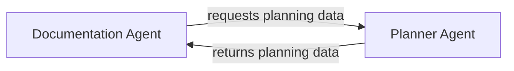

# Component Interactions
The workdir/nvidia-demo project is a Python-based project that utilizes various configuration files to define its architecture and components. The project has a modular design with separate components and tasks defined in the configuration files.

## System Architecture
The system architecture of the project is defined in the configuration files stored in the "config" directory. The main configuration files are:
- documentation_agents.yaml
- documentation_tasks.yaml
- planner_agents.yaml
- planner_tasks.yaml

## Core Workflows
The core workflows of the project are defined in the configuration files. The workflows involve the interaction between different components, such as the documentation agents and planner agents.

## Component Interactions
The component interactions are defined in the configuration files. The components interact with each other through APIs and interfaces. For example, the documentation agent interacts with the planner agent to retrieve planning data.

### Mermaid Diagram
The component interactions can be represented using a mermaid diagram:

This diagram shows the interaction between the documentation agent and the planner agent.

## Setup Instructions
To set up the project, follow these steps:
1. Install the required dependencies listed in the requirements.txt file.
2. Configure the configuration files in the "config" directory.
3. Run the project using the Python interpreter.

## Code Examples
The code examples can be found in the project directory. For example, the documentation agent code can be found in the "workdir/nvidia-demo" directory.

## Conclusion
In conclusion, the component interactions in the workdir/nvidia-demo project are defined in the configuration files and involve the interaction between different components, such as the documentation agents and planner agents. The component interactions can be represented using a mermaid diagram. To set up the project, follow the setup instructions and refer to the code examples in the project directory.