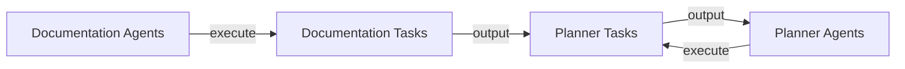

# Core Workflows Documentation
The workdir/nvidia-demo project is a Python-based project that utilizes various configuration files to define its architecture and components. The project has a modular design with separate components and tasks defined in the configuration files.

## Introduction
The workdir/nvidia-demo project is a Python-based project that utilizes various configuration files to define its architecture and components. The project has a modular design with separate components and tasks defined in the configuration files.

## System Architecture
The project's architecture is defined in the configuration files located in the `config` directory. The main configuration files are:
- `documentation_agents.yaml`
- `documentation_tasks.yaml`
- `planner_agents.yaml`
- `planner_tasks.yaml`

These files define the components, tasks, and workflows involved in the project.

## Core Workflows
The core workflows in the project involve the interaction between the documentation agents, planner agents, and their respective tasks. The workflows can be visualized using mermaid art diagrams.

## Setup Instructions
To set up the project, follow these steps:
1. Clone the repository from the remote origin.
2. Install the required dependencies listed in the `requirements.txt` file.
3. Configure the components and tasks by modifying the configuration files in the `config` directory.

## Code Examples
The project's codebase includes example code for the documentation agents and planner agents. The `Building_Code_Documentation_Agents.ipynb` file provides an example of how to build and execute the documentation agents.

## Conclusion
In conclusion, the workdir/nvidia-demo project's core workflows involve the interaction between the documentation agents, planner agents, and their respective tasks. The workflows can be visualized using mermaid art diagrams, and the project's architecture is defined in the configuration files located in the `config` directory.