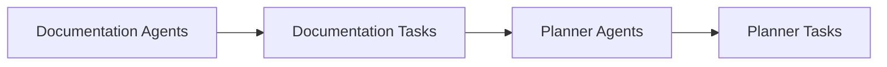

# System Architecture
The workdir/nvidia-demo project is a Python-based project that utilizes various configuration files to define its architecture and components. The project has a modular design with separate components and tasks defined in the configuration files.

## Configuration Files
The project uses the following configuration files:
- `documentation_agents.yaml`
- `documentation_tasks.yaml`
- `planner_agents.yaml`
- `planner_tasks.yaml`

These files are located in the `config` directory and are used to define the components and tasks of the project.

## Components and Tasks
The components and tasks of the project are defined in the configuration files. For example, the `documentation_agents.yaml` file defines the agents used for documentation, while the `documentation_tasks.yaml` file defines the tasks related to documentation.

## Mermaid Art Diagrams
To represent the flows and relationships between components, mermaid art diagrams can be used. Mermaid is a tool that allows you to create diagrams and flowcharts using a simple syntax.



This diagram shows the relationship between the documentation agents, documentation tasks, planner agents, and planner tasks.

## Setup Instructions
To set up the project, follow these steps:
1. Install the required dependencies by running `pip install -r requirements.txt`.
2. Configure the components and tasks by editing the configuration files.
3. Run the project by executing the main Python script.

## Code Examples
For example, to define a documentation agent, you can use the following code:
```yml
# documentation_agents.yaml
agents:
  - name: agent1
    type: documentation
```

To define a documentation task, you can use the following code:
```yml
# documentation_tasks.yaml
tasks:
  - name: task1
    type: documentation
    agent: agent1
```

## Conclusion
The workdir/nvidia-demo project has a modular design with separate components and tasks defined in the configuration files. The project uses mermaid art diagrams to represent the flows and relationships between components. By following the setup instructions and using the code examples, you can configure and run the project.